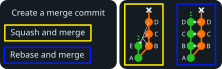
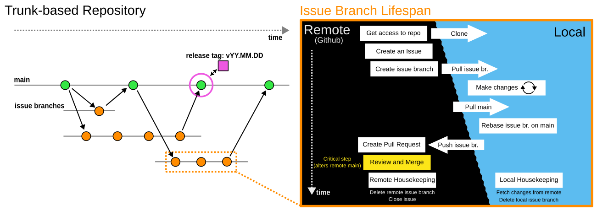

# Guidelines for the CT Lab Github Organization

**Contents:**

1. [What You Will Need](#what-you-will-need)
2. [Overview](#overview)
   1. [How Our Versioning Works](#how-our-versioning-works)
   2. [Merge Strategies](#merge-strategies)
3. [General Workflow](#general-workflow)
4. [Creating a Release](#creating-a-release)

This guide describes general tools and workflows for using and maintaining, and versioning coding projects in the CT Lab.

> Remember: **if in doubt, reach out!**

## What You Will Need

1) An integrated development environment (*IDE*) of your choice.
1) A [Github](https://github.com/login) account
   - Recommended: in your Github profile, under `Access` → `Emails`, add your school email (*000000@vutbr.cz*). <!-- TODO - add info, confirm requirements on github edu/pro etc. -->
1) [Git](https://git-scm.com/downloads) installed on your machine.
   - [Intro course here](https://learn.microsoft.com/en-us/training/modules/intro-to-git/) (part of the [github foundations](https://learn.microsoft.com/en-us/training/paths/github-foundations/) course).
   - See the [supplementary glossary](Supplement.md#glossary-of-terms) for Git-related jargon.
1) Recommended: A Git GUI Client
   - [GitHub Desktop](https://desktop.github.com/),
   - Built-in [Git/Github tools](https://code.visualstudio.com/docs/sourcecontrol/overview) in VS Code,
   - or [others](https://git-scm.com/downloads/guis).

## Overview

### How Our Versioning Works

We use [trunk-based](https://www.atlassian.com/continuous-delivery/continuous-integration/trunk-based-development) development, a **simple** version control practice designed around one `main` (*trunk*) branch and small `feature` branches.
Issue branches are short-lived, and they typically split from `main` and merge back into it.

Trunk-based development uses two branch types:

- **`main`**: stable state of the project, assumed as the main functional version. The only persistent branch in the repo.
- **`feature`**: short-lived branches for working on new features, enhancements, bug fixes, etc. They branch off of `main`. They are merged back into `main` at the end of their lifespan. Delete them once they are successfully merged.

> Smaller `feature` branches (i.e., branches with few changes) are easier and faster to review, which promotes discussions and cleaner code.

### Merge Strategies

There are several ways to merge an `issue` branch into `main`, with different use-cases. We recommend:

- **Rebase and merge** leads to a more granular and detailed commit history. Use if you want to preserve detail and/or if merging commits from multiple contributors.
- **Squash and merge** leads to a leaner repository. Use if keeping every issue branch commit is not important.



> See the [glossary](Supplement.md#git) for the technical definitions of *rebase* and *squash*.

## General Workflow

<!-- TODO continue here -->

Remember: these are guidelines.
The important part is that your software project has a **Github repository** with a **main branch** which contains **working code**.
How you get there is up to you (and your team).
The workflow suggested below was designed to keep things simple and clean while covering most common use-cases, and is split into 7 phases.
Each phase links to a hands-on walkthrough with screenshots where one exists.

The graphic below shows a generic trunk-based repository and the lifespan of one of its issue branches:



### 1) Create/Get Access to a Project Repository

- You will typically get access from a senior.
- *Seniors*:
  - Grant access to a repository in `Settings` → `Collaborators and teams` → `Add people`/[`Add teams`](https://docs.github.com/en/organizations/organizing-members-into-teams/about-teams)
  - Use the [template repository](https://github.com/CEITEC-CTLAB/template_repo.git) to quickly set up new repos
    - You can either go to the template and click `Use this template`
    - Or make a `New repository` and choose a template in the *Repository template* section
    - The linked template contains further instructions on how to set up your new repo
- Once you have access **clone** the Repository to Your Local Machine
  - See the [VS Code clone walkthrough](vs_code_clone_make_changes_push.md) for a click-by-click example, or use the [Command Line](https://docs.github.com/en/repositories/creating-and-managing-repositories/cloning-a-repository), [GitHub Desktop](https://docs.github.com/en/desktop/adding-and-cloning-repositories/cloning-and-forking-repositories-from-github-desktop), or any other Git interface.

### 2) Create an Issue

- Walkthrough: [Create an Issue and Branch](github_create_issue_and_branch.md)
- Start with an **issue template** if available, and add a descriptive title, a concise description, and appropriate labels.
- Setup Time/project Management for the Issue
  - Useful for more complex issues or larger teams. *Seniors*: use at your own discretion (see the [Supplement](Supplement.md#issue-time-and-project-management) for more info).

### 3) Create a New Issue Branch

- Walkthrough: [Create an Issue and Branch](github_create_issue_and_branch.md) (same doc — branch is created straight from the issue)
- Choose a branch name, preferably one which follows the pattern: `<issue_ID>_short_description`
  - e.g.: `10-rng` - branch for issue #10 titled "adding a random number generator".
- See [How Our Versioning Works](#how-our-versioning-works) for why issue branches are short-lived.

### 4) Make Changes to the Code Locally

- Walkthrough: [VS Code: Clone, Make Changes, and Push](vs_code_clone_make_changes_push.md)
- Setting up a language environment first? See [VS Code: Set Up a Python Environment](vs_code_setup_python_env.md).
- Commit changes locally (using the Git interface of your choice)
  - Commit frequently.
  - Change one thing per commit: fix one bug or a group of related bugs, add one feature, etc.
  - Commit messages are [short and to the point](https://tbaggery.com/2008/04/19/a-note-about-git-commit-messages.html) and written in the imperative:
    - Example: for issue with tag #10 in GitHub, commit a bugfix, where the function get_result() caused a DivisionByZero error for certain inputs:

      ```#10: Fix division by 0 in get_result()```

### 5) Push Changes to Remote GitHub Repository

- Walkthrough: [VS Code: Clone, Make Changes, and Push](vs_code_clone_make_changes_push.md)
- Pushes can be *less frequent* than local commits, but important for *backup* and *sharing your code*.

### 6) Create a Pull Request

- Walkthrough: [Create a Pull Request and Get a Review](github_create_pull_request_and_get_review.md)
- Provide a title and concise description, which should explain the contents and purpose of the PR.
  - If the PR closes an issue (which may not always be the case), you can use [keywords](https://docs.github.com/en/issues/tracking-your-work-with-issues/using-issues/linking-a-pull-request-to-an-issue) to link the issue to the PR.
- Assign responsible *seniors* who will `Review` and `Merge` your PR.
- **Notes**:
  - PRs are a place to discuss and improve code. Don't be afraid to open PRs and provide/receive constructive criticism.
  - Remember to **keep branches small!**
  - Before you open a PR, make sure to **rebase** your `issue` branch on the latest commit in `main`. This makes for much smoother merging.

### 7) Review and Merge

- Walkthrough: [Create a Pull Request and Get a Review](github_create_pull_request_and_get_review.md)
- Wait for reviews of your pull request. Discuss your code, respond to feedback and requests for changes.
  - Do not hesitate to remind your reviewer if they're late with your review.
- Once approved, your changes will be merged into the target branch by a *senior*. See [Merge Strategies](#merge-strategies) for guidance on choosing between rebase and squash.
- **Delete** the merged `issue` branch after merging.

## Creating a Release

[Releases](https://docs.github.com/en/repositories/releasing-projects-on-github/about-releases) are packaged versions of software ready for distribution and use.
They are associated with a specific commit on the `main` branch using a [tag](https://git-scm.com/book/en/v2/Git-Basics-Tagging).
The tag contains a unique version number, preferably using [*Calendar Versioning*](Supplement.md#calendar-versioning).
Releases can contain source code (included automatically), compiled binaries of the code, and any other relevant files (manuals, [documentation](templates/documentation/README.md), etc.).
To create a release:

1. In Github repository: `Releases` → `Draft a New Release`
2. `Choose a tag` → create a *CalVer* tag for the release (`vYY.MM.DD`) → `Create new tag...`
3. assign the `main` branch as the `Target`.
4. If applicable, choose a previous release tag to compare to the current release (auto is usually ok) and click `Generate release notes`
5. If needed, adjust the generated *release title* and *release notes*
6. Drop in any additional files you want to include in the release
7. At this point, you are ready to `Publish release`. Make sure to get the go-ahead from other team members beforehand.


<!-- TODO - discarded text - keep what looks good, delete the rest -->

<!-- ([Development Operations](https://www.atlassian.com/devops/what-is-devops/how-to-start-devops))
The main goal of this guide is to promote clean repositories, maintainable code, and consistent project outputs while keeping repository maintenance as simple as possible. -->

<!-- ### Team Roles and Permissions

You will find yourself working on software projects either alone or in a small team. In the latter case, team roles may be fuzzy, but the team will generally contain **Juniors** and at least one **Senior**.

- **Juniors**: **commit** code, **submit** pull requests, **suggest** enhancements, **report** bugs, **create** issues (in the Github sense), and **consult** frequently with seniors.
- **Seniors** (Administrators): **review** code, **merge** pull requests, **report** to higher-ups, **supervise** project direction and coding standards, and **maintain** the repository. Crucially, they **consult** with the team and **provide guidance**.

For administrators: **Repository Management** can be enhanced by setting up a [Team](https://docs.github.com/en/organizations/organizing-members-into-teams) - this allows you to adjust access of teams members to your repository, protect your code, and use additional project management tools. -->


