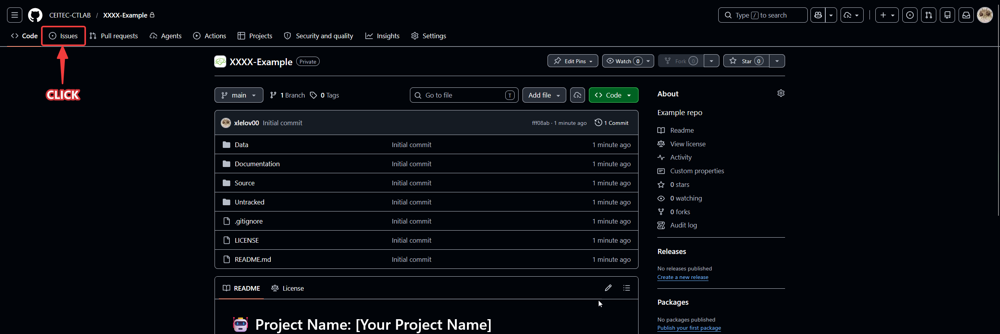
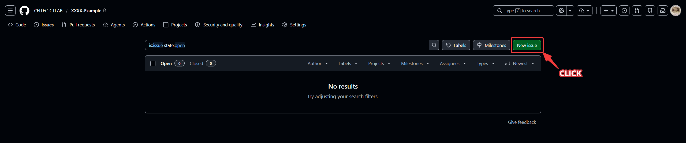
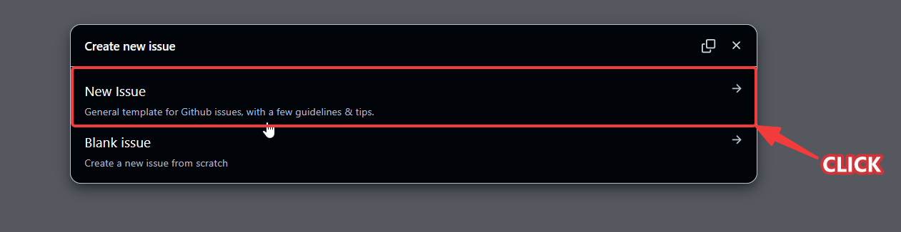
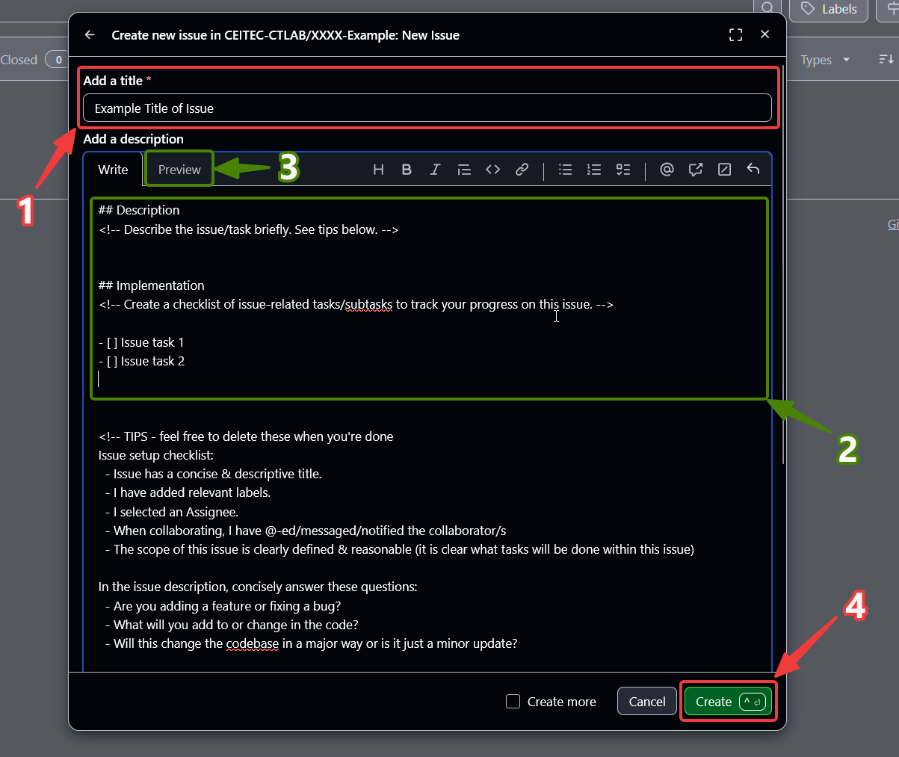
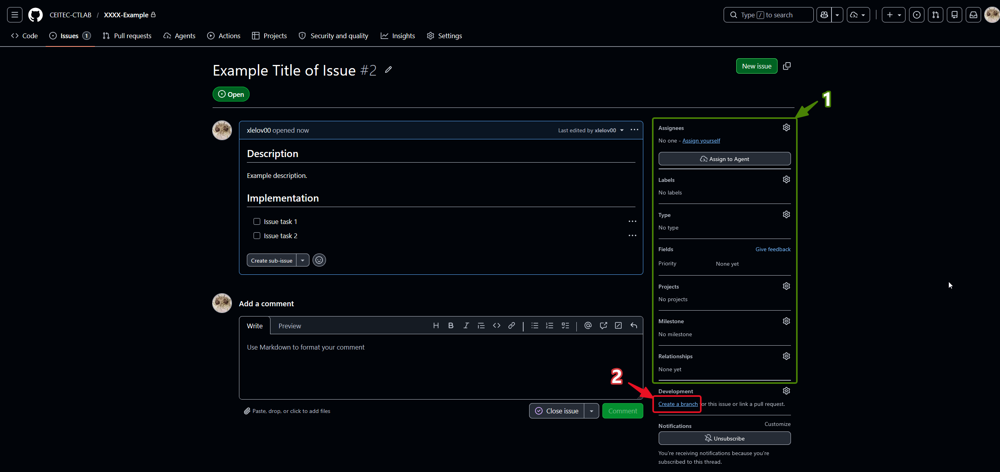
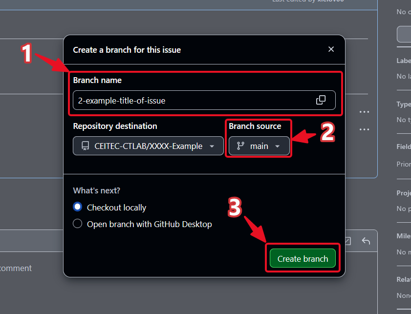
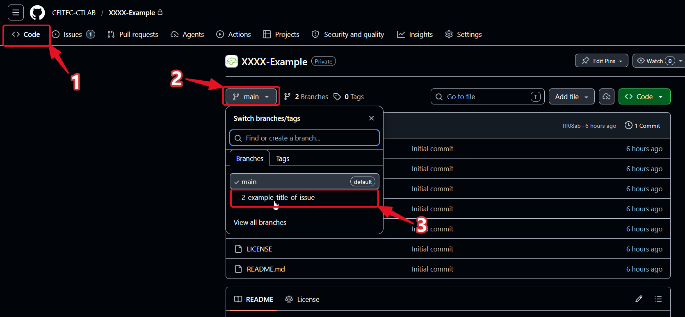

# Create an Issue and Branch on GitHub

## Before you start
- GitHub Organization access — invited via email by your supervisor or org admin

> [!WARNING]
> **Check which repository you are on!** This walkthrough page lives in the public **`.github`** repository — that is most likely **not** your own repository.
>
> Create the issue on **your own repository**, not on `.github`. If you stay on `.github` you probably won't be able to create a branch, since `.github` is private/restricted.
>
> If you accidentally created an issue on `.github` by mistake, close it: open the issue, scroll to the **bottom of the page**, and click **Close issue** (issue settings).

---

## 1) Click on Issues

Go to your repository and click the **Issues** tab in the top navigation bar.

---

## 2) Click on New Issue

Click the **New issue** button in the top-right corner.

---

## 3) Create new issue from template

Select the **New Issue** template (not "Blank issue") — it includes guidelines and tips.

---

## 4) Fill in issue metadata and create

1. Add a **title** to the issue
2. (Optional) Fill in the **description** — what the issue is about and an implementation checklist
3. (Optional) Click **Preview** to check how it looks
4. Click **Create** to submit the issue

---

## 5) Fill in more metadata and create a branch from the issue

1. (Optional) Set **Assignees**, Add **Labels** and more to fill the issue — see [Issue Time and Project Management](Supplement.md#issue-time-and-project-management) for milestones/projects
2. Click **Create a branch** under the **Development** section on the right sidebar

---

## 6) Create the branch

1. Check the auto-generated **branch name** (e.g. `2-example-title-of-issue`) — change it if needed
2. Check that **Branch source** is set to `main`
3. Click **Create branch**

See [How Our Versioning Works](Github_Guidelines.md#how-our-versioning-works) for why we branch off `main` this way.

---

## 7) Verify the branch on the repo page

1. Click **Code** to navigate to the main repo page
2. Click the **branch selector** dropdown
3. Select your new branch to confirm it exists and start working on it

---

## Done

Your issue and branch are ready. Now go to the [VS Code clone & push walkthrough](vs_code_clone_make_changes_push.md) to start working locally.
