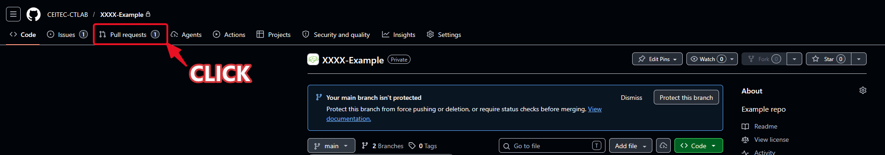
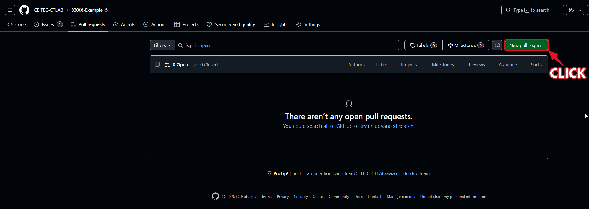
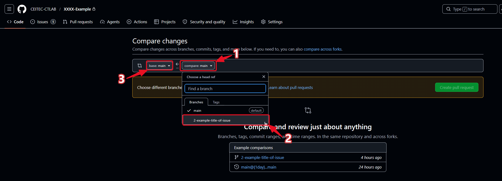
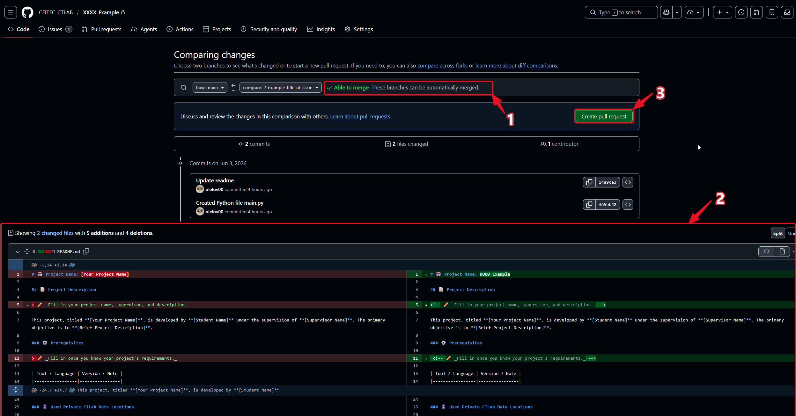
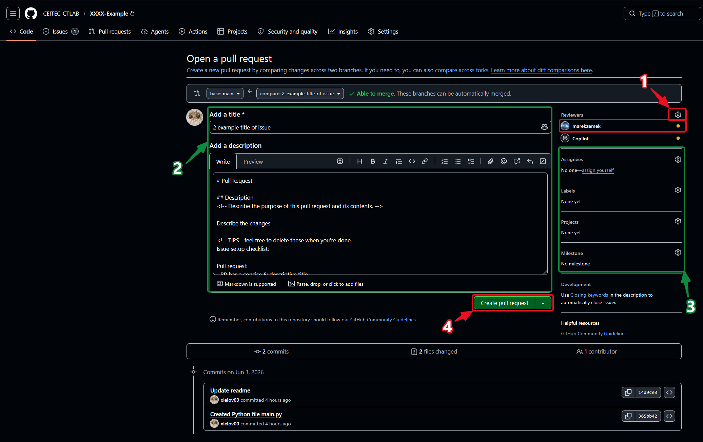
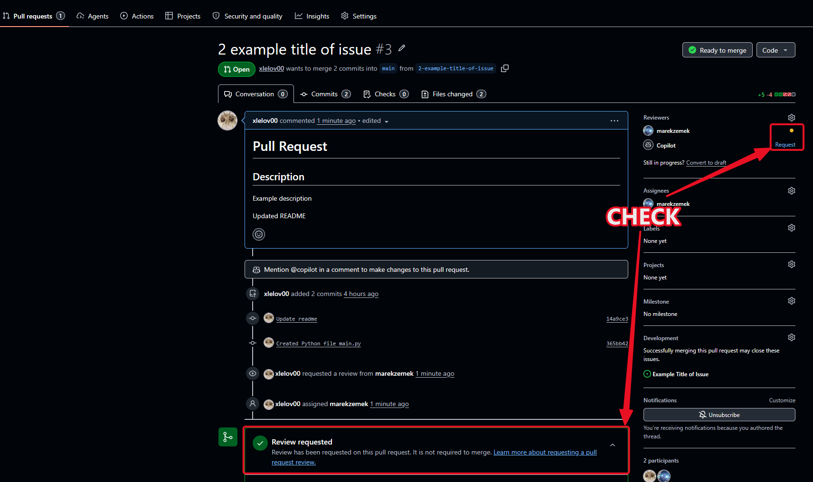
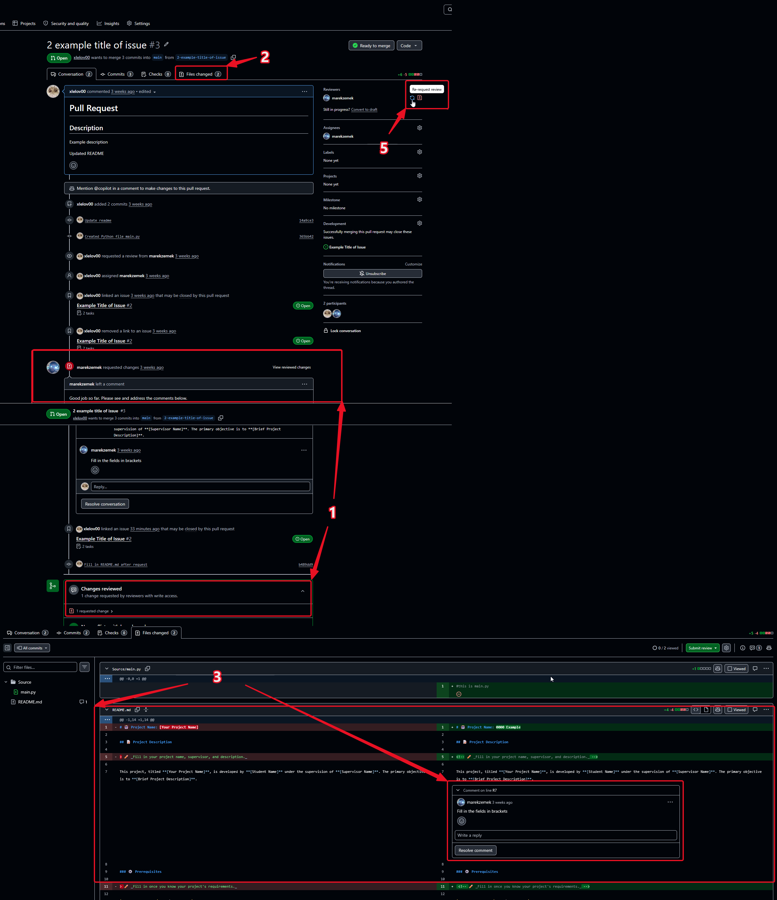
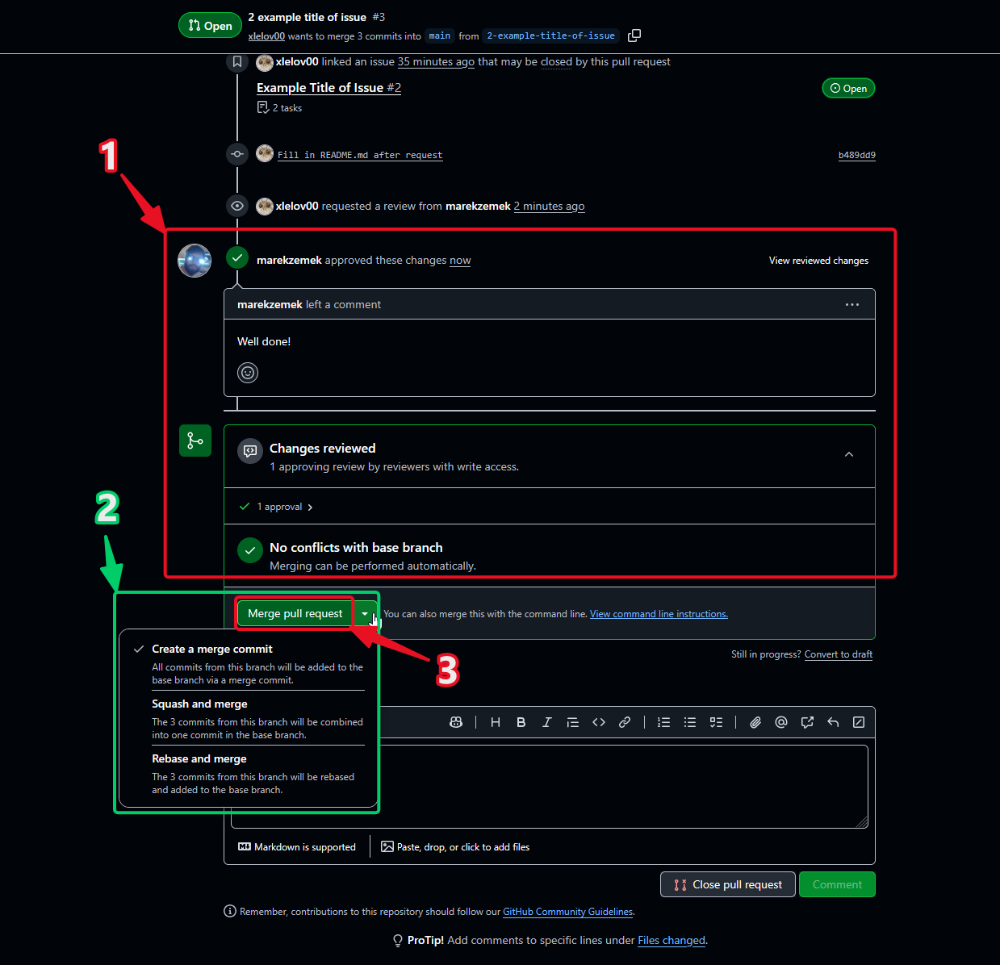
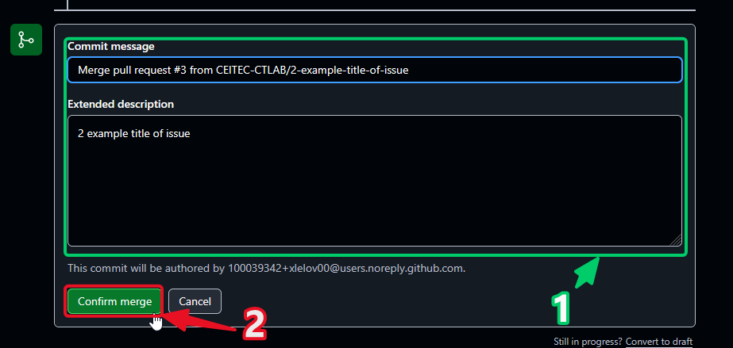
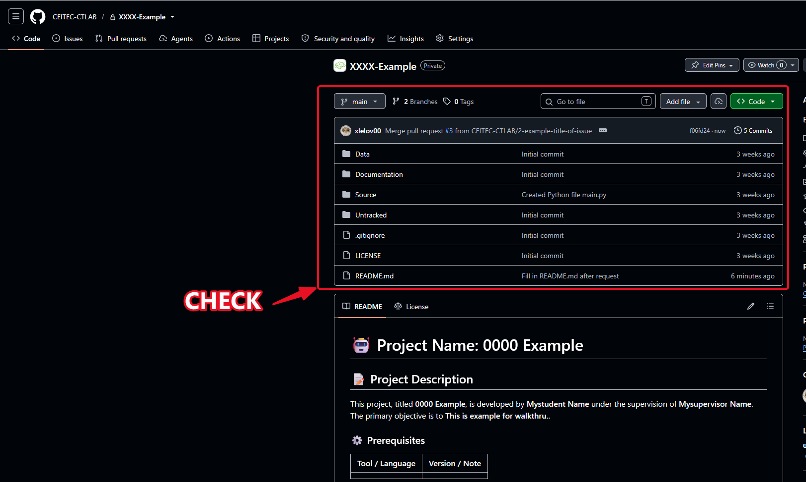

# Create a Pull Request and Get a Review

## Before you start
- GitHub Organization access — invited via email by your supervisor or org admin
- Created issue and branch on GitHub (see [github_create_issue_and_branch.md](github_create_issue_and_branch.md))
- Pushed your changes to the branch (see [vs_code_clone_make_changes_push.md](vs_code_clone_make_changes_push.md))
---

## 1) Click on Pull requests

Go to your repository and click the **Pull requests** tab in the top navigation bar.

---

## 2) Click on New pull request

On the Pull requests page, click the **New pull request** button.

---

## 3) Set the branches to compare

1. Click the **compare** dropdown to unroll the list of branches
2. Select the branch where you made your recent changes (e.g. `2-example-title-of-issue`)
3. Click the **base** dropdown the same way if you need to compare against a different branch (default is `main`)

---

## 4) Check the comparison and create the pull request

1. Check the **Able to merge** message to confirm the branches can be merged automatically
2. Review the changed files and the diff to confirm the changes are what you expect
3. Click **Create pull request**

---

## 5) Assign a reviewer and create the pull request

1. Assign a **Reviewer** in the right sidebar
2. Check/edit the **title** and (optionally) fill in the **description**
3. (Optional) Fill in more metadata — labels, assignees, projects, milestone
4. Click **Create pull request**

---

## 6) Check that the issue is linked and the review is requested

1. Check the **Development** section in the sidebar — if your branch was created from an issue, it's linked automatically
2. Check the **Reviewers** section — if a review hasn't been requested yet, click **Request** next to the reviewer's name
3. Confirm the **Review requested** notice appears at the bottom of the conversation

---

## 7) Now wait for the review

Wait for the reviewer to check your pull request — they will either approve it or request changes.

---

## 8) If changes are requested, address them and re-request review

1. Check for a **Changes requested** notice and read the reviewer's comments
2. Reply to or resolve the comments where needed
3. Make the requested changes locally, then commit and push — see [vs_code_clone_make_changes_push.md](vs_code_clone_make_changes_push.md) (you can also just reply with a comment if no code change is needed)
4. Click **Re-request review** next to the reviewer's name once pushed

---

## 9) Once approved, merge the pull request

1. Check that the reviewer **approved** the changes and that there are **no conflicts** with the base branch
2. (Optional) Click the dropdown arrow next to **Merge pull request** to pick a different merge strategy — Create a merge commit / Squash and merge / Rebase and merge. See [Merge Strategies](Github_Guidelines.md#merge-strategies) for guidance on choosing between them.
3. Click **Merge pull request**

---

## 10) Confirm the merge

1. (Optional) Edit the commit message
2. Click **Confirm merge**

---

## 11) Optionally delete the branch

Once merged and closed, click **Delete branch** to clean up the now-merged branch. Whoever merges the pull request is responsible for this — also check that the linked issue was closed automatically, and close it manually if not.

---

## 12) Check that the changes landed on the destination branch

Open the base branch (e.g. `main`) and confirm your merge commit and file changes are there.

---

## Done

Your changes are reviewed and merged. To start the next task, go back to the [Create an Issue and Branch walkthrough](github_create_issue_and_branch.md).
