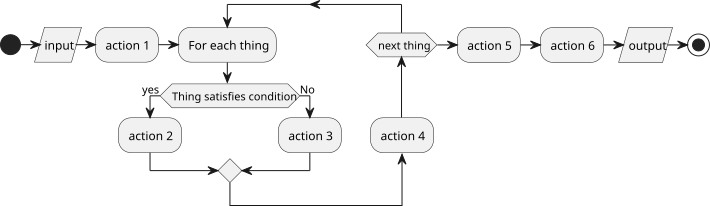

<!--
This template is suitable for submitting source code.
Its main focus is providing the reader with a solid grasp on the underlying processes, physics, and mathematics used in the code package.
It should give the reader enough information to allow them to further work with the source code.
-->

<!--
Recommended VS Code extensions for working with Markdown:
    Markdown All in One - some Markdown perks (table of contents, auto completions, HTML export, ...)
    Markdown Extended - support for extended markdown syntax
    Markdownlint - linting & style checking
    Markdown+Math - TeX math typesetting support for Markdown
    PlantUML - Support for WSD diagrams
    Markdown PlantUML Preview - Support for PlantUML inside Markdown
For more info on Markdown, go to https://www.markdownguide.org/
-->

# >Project Name<: Methodology & Documentation

Prepared at the *CT Lab*, *Central European Institute of Technology*, *Brno University of Technology*

- [\>Project Name\<: Methodology \& Documentation](#project-name-methodology--documentation)
  - [Overview](#overview)
  - [Definition of Terms](#definition-of-terms)
  - [Process](#process)
    - [Subprocess 1](#subprocess-1)
    - [Subprocess 2](#subprocess-2)
  - [References \& Further Reading](#references--further-reading)
  - [Appendix](#appendix)

## Overview

Describe the background/motivation and purpose of >Project Name<, along with anything else the reader should know about >Project Name< as a whole. Be as concise as possible. Include visuals such as the one below:


<!--  -->

## Definition of Terms

term_1
: an example of a term used during the process described below

term_2
: another example of a term

term_3
: yet another example of a term

## Process

Summarize the process as a whole in a few sentences. Use visuals, such as diagrams:

<!-- Insert chart as image -->


<!-- Insert chart as codeblock (using Markdown PlantUML Preview)
 PlantUML is recommended, but you can use other software based on your preferences. -->
<!-- ```plantuml

@startuml Stitching
start

:input; <<load>>

:action 1;

repeat :For each thing;

        if (Thing satisfies condition) then (yes)
            :action 2;
        else (No)
            :action 3;
        endif

:action 4;

repeat while (next thing)

:action 5;

:action 6;

:output; <<save>>

stop
@enduml

``` -->

### Subprocess 1

**Inputs**: term_1, term_2

**Outputs**: term_3

**Summary**: Summarize the purpose of subprocess 1 in a sentence or two.

**Description**:

- Explain the actions taken in Subprocess 1 step by step
- Go as in-depth as needed to be as clear-cut as possible
- Try to be concise yet thorough

**Code**:

- *foo* - a function used in Subprocess 1 to do a thing
- *bar* - a class used in subprocess 1 to hold some data and do some things
- *package_1* - an external dependency which is worth mentioning here

**Issues**: Mention any outstanding issues with the current state of Subprocess 1. If somebody else were to start working on the code tomorrow, what should they watch out for?

### Subprocess 2

**Inputs**:

**Outputs**:

**Summary**:

**Description**:

**Code**:

**Issues**:

## References & Further Reading

- List scientific papers and other sources you used in the methodology
- Include useful articles & websites to provide more context ()

## Appendix

- Include anything that may be useful but does not fit into the main body of the methodology. Make sure to reference the appendix in the main body.
