# VS Code: Clone, Make Changes, and Push

## Before you start

- GitHub Organization access — invited via email by your supervisor or org admin
- Created issue and branch on GitHub (see [github_create_issue_and_branch.md](github_create_issue_and_branch.md))

---

## 1) Install VS Code from MS Store

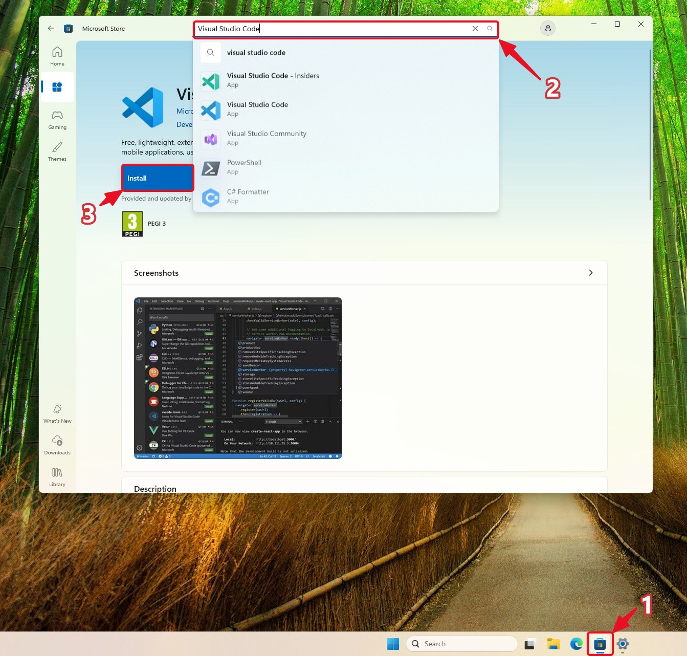

1. Open the **Microsoft Store** app on your device
2. Search for **Visual Studio Code**
3. Click **Install**

VS Code installs Git automatically on first launch. Problems? Contact IT support.

---

## 2) Sign in using GitHub

On the VS Code welcome screen, click **Continue with GitHub**.

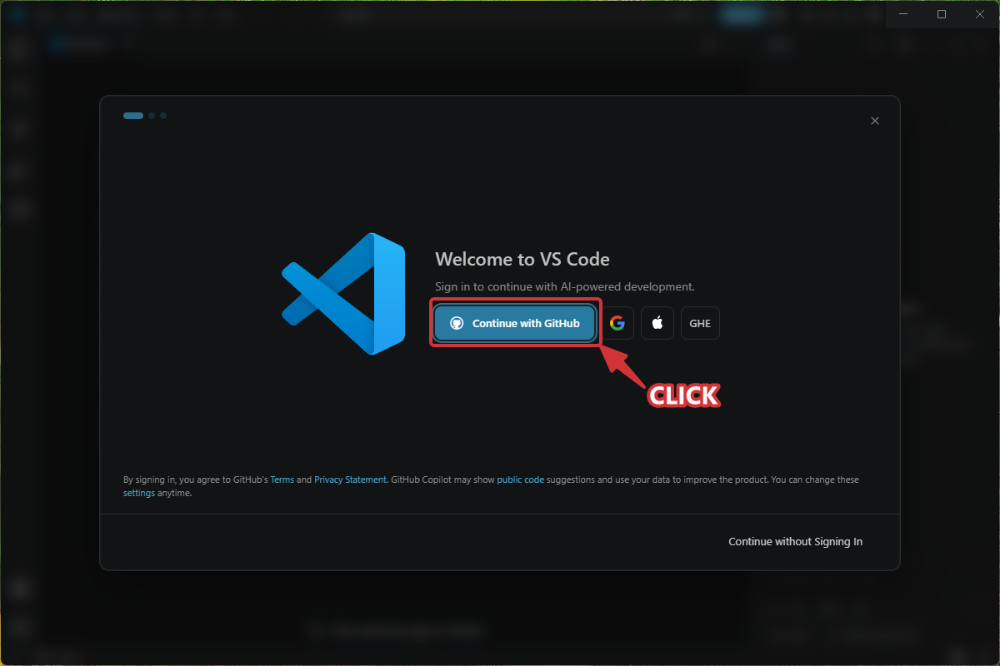

Alternatively, click the **Accounts** icon in the bottom-left corner of VS Code and select **Sign in with GitHub**.

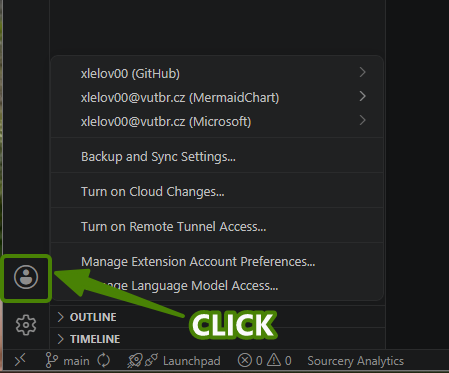

---

## 3) Sign in with your VUT email

1. In the browser that opens, enter your **VUT account** credentials — using your school account also gives you access to [GitHub Education](https://education.github.com) benefits
2. Click **Sign in**

---

## 4) Confirm to synchronize

When the browser asks to open Visual Studio Code, click **Open**.

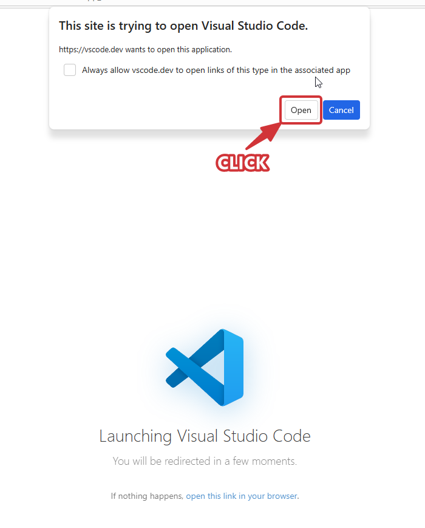

---

## 5) Clone the repository

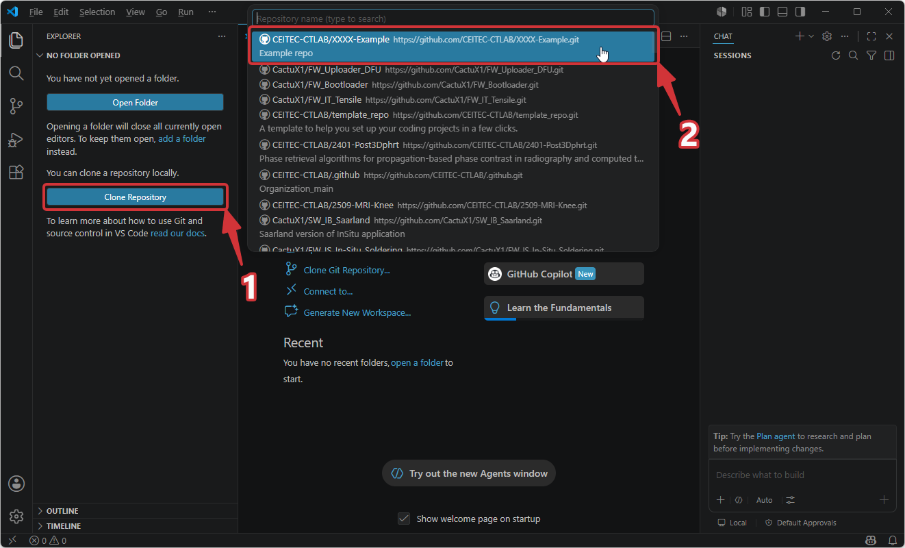

1. Click **Clone Repository** in the file explorer panel
2. In the top panel, select your repository — browse via **GitHub → your account name → repositories**

---

## 6) Select repo destination

Choose a local folder (e.g. `Documents/GitHub`) and click **Select as Repository Destination**.

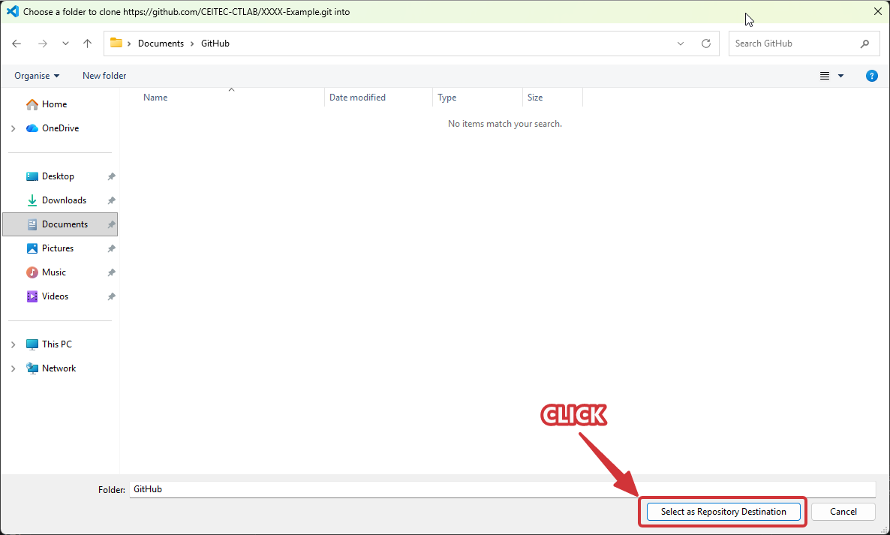

---

## 7) Change to your working branch

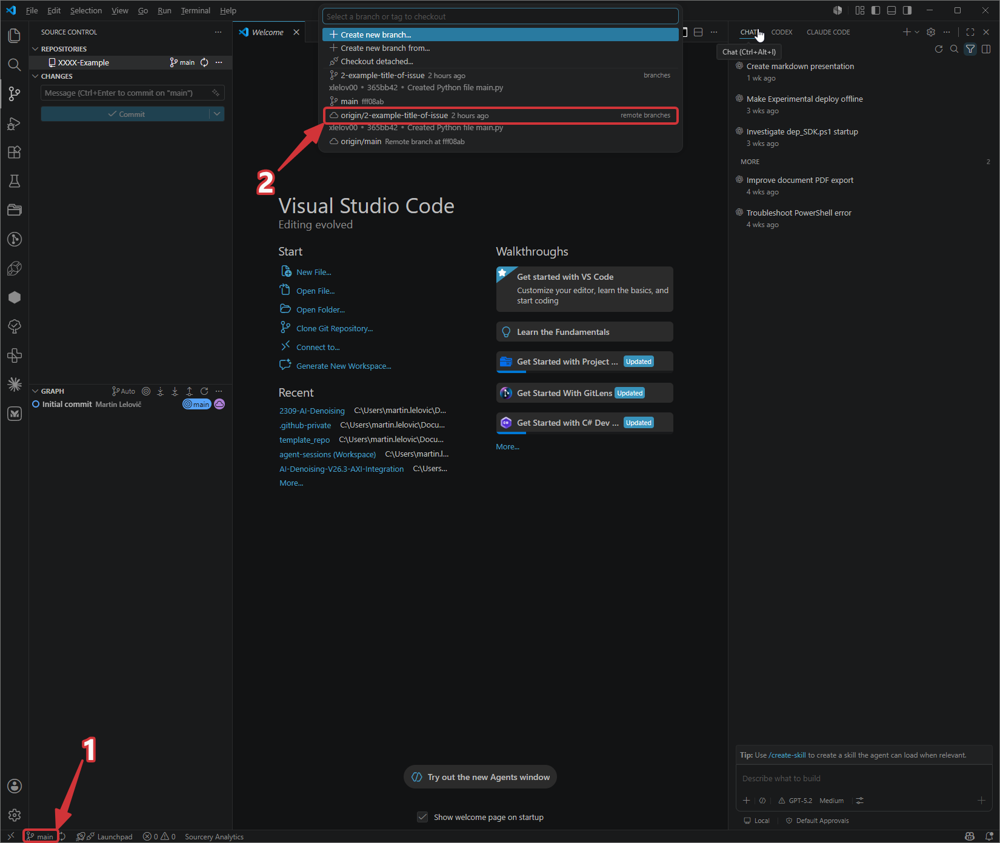

1. Click the branch name in the **status bar** (bottom-left corner)
2. From the selector that appears at the top, select the branch you want to work on (e.g. `2-example-title-of-issue`)

---

## 8) Install the Git Graph extension

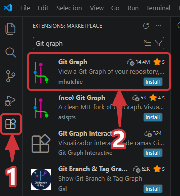

1. Click the **Extensions** icon in the left sidebar and search for `Git Graph`
2. Install **Git Graph** — it lets you visualize your branch history

---

## 9) Update the README

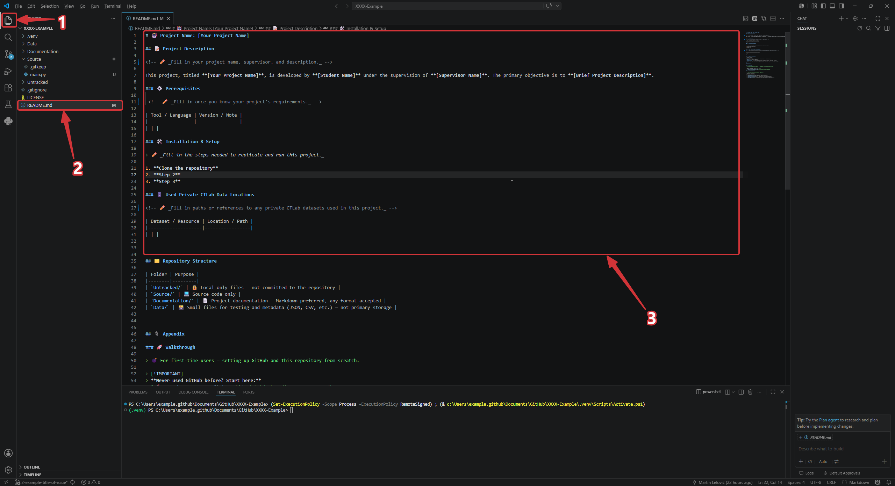

1. Select the **Explorer** panel (file view) in the left sidebar
2. Open `README.md`
3. Fill in the placeholders — title, description, supervisor, developer — and any other project info you know

---

## 10) Commit through Source Control

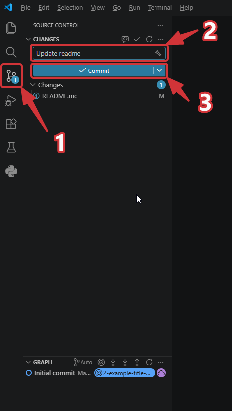

1. Click the **Source Control** icon in the left sidebar
2. Type a short commit message that describes the changes made — see [commit message conventions](Github_Guidelines.md#4-make-changes-to-the-code-locally) for guidance
3. Click **Commit** to save to your local repository

---

## 11) Push to remote

Click **Sync Changes** to push your commit to GitHub.

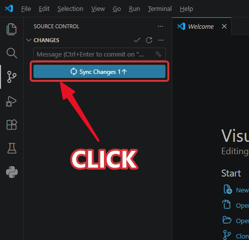

---

## Done

Your changes are on GitHub. Verify by opening your branch on GitHub and checking the commits.
