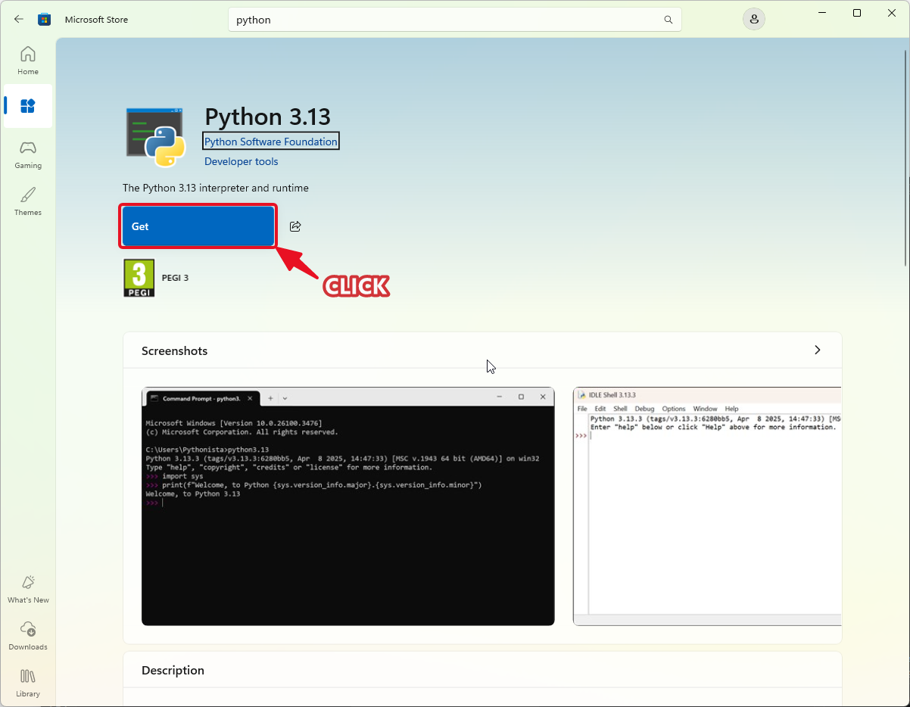
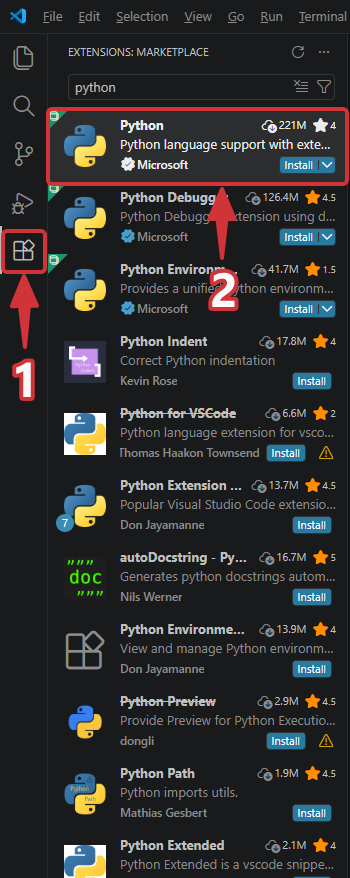
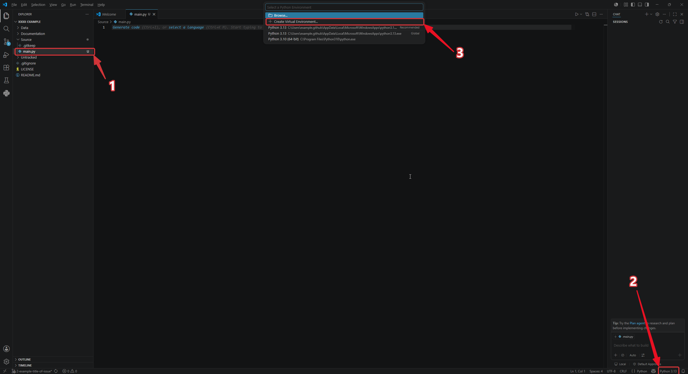
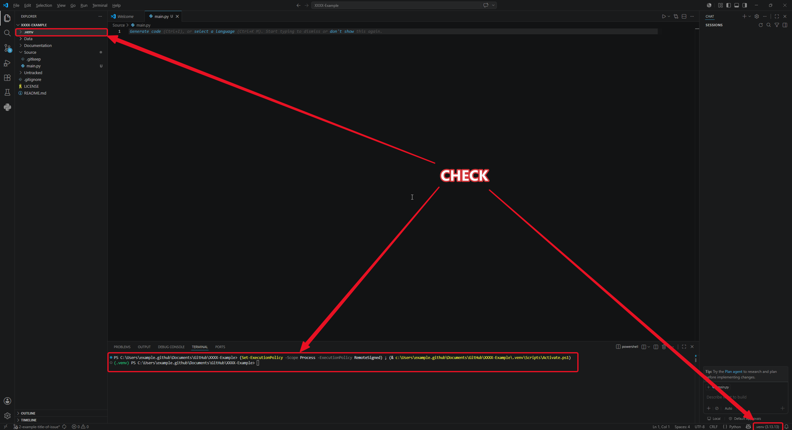

# VS Code: Set Up a Python Environment

## Before you start

- GitHub Organization access — invited via email by your supervisor or org admin
- Created issue and branch on GitHub (see [github_create_issue_and_branc.md](github_create_issue_and_branc.md))
- Installed VS Code and cloned repository inside (see [vs_code_clone_make_changes_push.md](vs_code_clone_make_changes_push.md))

---

## 1) Install Python from MS Store

Search for **Python 3.XX** in the Microsoft Store and click **Get**.

---

## 2) Install the Python extension in VS Code

1. Click the **Extensions** icon in the left sidebar and search for `Python`
2. Install the official **Python** extension by Microsoft

---

## 3) Create a virtual environment

1. Create or open a Python file in the `Source` folder
2. Click the Python version in the **status bar** (bottom-right corner) to open the interpreter picker
3. Select **Create Virtual Environment** and choose your installed Python version

---

## 4) Check that the virtual environment was created

Confirm that a `.venv` folder appears in the Explorer panel and that the terminal prompt shows `(.venv)`.

---

## Done

Your Python environment is ready. Install packages with `pip install <package>` in the terminal.
